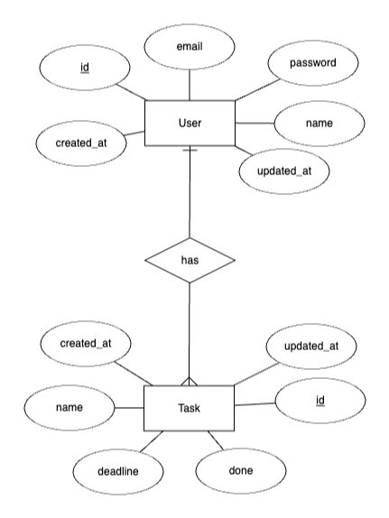

# To Do App

## Requirements

-   PHP >8.2.0
-   Composer >2.5.0
-   NodeJS >18
-   npm >9.5.0
-   yarn >1.22.0
-   MySQL or MariaDB

## How to setup the environment?

-   Create a separate user and database for the app (eg. database name: todo-app, username: todo-app)
-   Create a .env file based on the .env.local with your MySQL server's connection data
-   Install Composer dependencies: `composer install`
-   Install NodeJS dependencies: `npm install`
-   Run database migrations: `php artisan migrate`
-   Run database seed script: `php artisan db:seed`

## How to start the project?

-   Start the backend in one terminal: `php artisan serve`
-   Start the frontend in another terminal: `npm run dev`
-   Open the site in the browser: `http://localhost:8000`
-   You can login with the email `test@example.com` and password `password`

## Entity-relationship diagram

## Testing

You can read the test documentation here: [Teszt dokumentáció.pdf](Teszt dokumentáció.pdf)

All of the tests have been implemented with Playwright, you can run them with the following command: `npm test`
